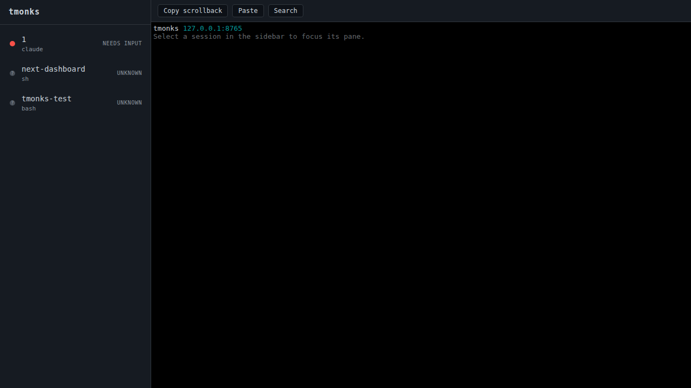
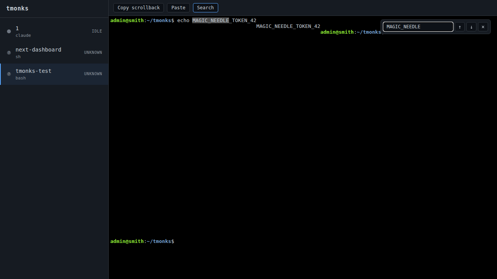

# Search

`tmonks` lets you search the visible terminal buffer and scrollback of the focused pane, powered by the `xterm.js` search addon.

## Opening the overlay

Two ways to open:

- Click **Search** in the top toolbar.
- Press **Ctrl-F** (Linux/Windows) or **Cmd-F** (macOS) while the terminal has focus.

## Using the overlay

Type into the search box; matches highlight in the pane as you type. The overlay floats over the top-right of the pane.

| Key | Action |
|-----|--------|
| `Enter` | Jump to next match |
| `Shift-Enter` | Jump to previous match |
| `Escape` | Close overlay, clear highlights |
| Toolbar `↑` / `↓` | Previous / next match |
| Toolbar `×` | Close overlay, clear highlights |
| Ctrl/Cmd-F (again) | Toggle overlay closed |

Search is case-insensitive, substring (no regex, no whole-word).

## Scope

Search runs against whatever the addon has in its terminal buffer — that's the live alt-screen plus scrollback retained client-side, not the full tmux history. If you need to grep further back than what the browser is holding, use `Copy scrollback` (toolbar) to dump up to 5 MiB and search it locally.
