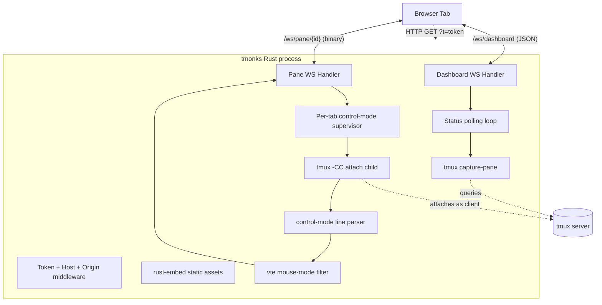

# feat: tmonks — Web UI for tmux sessions

## Overview

`tmonks` is a single Rust binary that launches a local web server exposing a browser-based UI for the user's tmux sessions. Open the URL on a phone or laptop, see a sidebar of sessions with status badges (idle / working / needs-input), click one to focus it, and interact with the live session through `xterm.js` — including native browser copy/paste, on-screen keys for iOS-hostile inputs (`Esc` / `Tab` / `Ctrl-C` / arrows), and full physical-keyboard passthrough.

The MVP targets *agentic CLIs* specifically: `claude`, `codex`, and `opencode`. These render full-screen Ink/Bubble Tea TUIs with streaming text, spinners, and box-drawing. We need them to render faithfully and we need to detect their lifecycle states without modifying the CLIs themselves.

## Problem Frame

Using tmux from a phone or shared device is miserable. Native tmux requires `Ctrl-b` chords, has user-hostile copy-mode keybindings, fights the terminal for mouse selection, and has no notion of "here is a glanceable status of every session." For a user who runs multiple coding agents in parallel across sessions, the friction of switching between them and knowing which is waiting for input is significant. `tmonks` removes that friction by exposing tmux through a normal-feeling web UI while keeping native tmux untouched as the canonical store.

## Requirements Trace

- **R1.** Launch `tmonks` from the CLI and get a URL that opens a working browser UI.
- **R2.** Sidebar lists every tmux session on the host; clicking a session focuses it.
- **R3.** Focused pane shows the live tmux pane via `xterm.js`, including ANSI colors, spinners, streaming text, and alt-screen TUIs (Claude, Codex, opencode).
- **R4.** Browser copy/paste works the normal way (click-drag, Cmd-C, Cmd-V, double-click word select, triple-click line, right-click menu, context-menu Copy). No tmux copy mode.
- **R5.** Keyboard input flows from the browser into the focused pane — physical keyboard, with on-screen buttons for keys that are hard to type on iOS (`Esc`, `Tab`, `Ctrl-C`, arrows).
- **R6.** Sidebar shows per-session status — `idle` / `working` / `needs-input` — updated within ~1 second of state changes for the three supported agent CLIs.
- **R7.** Mobile-responsive: layout adapts from sidebar+main on desktop to a stacked / drawer layout on phone-width viewports.
- **R8.** Reasonable local-only security posture by default: binds to 127.0.0.1, requires a one-time token in the URL, and defends against DNS rebinding via Host-header allowlist.
- **R9.** Clean shutdown: closing the browser tab detaches the tmux client; Ctrl-C on the server detaches every client and exits cleanly.

## Scope Boundaries

**In scope (MVP):**
- One focused pane at a time per browser tab.
- Switching focus between sessions (kills old control-mode child, spawns new one).
- Switching active pane *within* a session via `select-pane` over control mode (no pane-tree UI; just whatever pane is currently active in the session's current window).
- ANSI color rendering through `xterm.js`.
- Status detection for Claude Code, Codex CLI, and opencode by command name + screen-content heuristics.

**Out of scope (roadmap, not v1):**
- Pane-tree / window-tree navigation in the sidebar.
- Creating, killing, or renaming sessions/windows/panes from the UI.
- Splits, layouts, or multi-pane simultaneous views.
- Saved input snippets / "canned command" library.
- HTTP/JSON scripting API for external automation.
- Themes, font config, custom keybindings.
- TLS, multi-user auth, accounts.
- Watching panes that haven't been focused recently (status only updates for panes the dashboard cares about, i.e. visible in the sidebar).

## Context & Research

### Relevant Code and Patterns

The repo is fully greenfield (only `README.md`, `LICENSE`, `.gitignore`, `.git/`). No prior Rust code, no `AGENTS.md`, no `CLAUDE.md`, no `Cargo.toml`. We're free to choose conventions. The single hint in `.gitignore` is a pre-added `**/mutants.out*/` line, suggesting `cargo-mutants` may be used later — non-binding.

### Institutional Learnings

A search of `docs/solutions/` returned no relevant prior solutions for any of the eight relevant topic areas (Rust+Axum WebSockets, tmux automation, xterm.js, VT/ANSI filtering, `tokio::process` lifecycle, browser clipboard, TUI state detection, embedded static assets). This is greenfield institutionally as well as repo-wise. Treat the tmux control-mode parser, mouse-mode stripping, and per-agent status heuristics as prime candidates for new `docs/solutions/` entries as bugs are encountered.

### External References

- [tmux Control Mode wiki](https://github.com/tmux/tmux/wiki/Control-Mode) — canonical protocol reference.
- [tmux Formats wiki](https://github.com/tmux/tmux/wiki/Formats) — `#{...}` variables used in `list-sessions -F` and `display-message -p -F`.
- [iTerm2 tmux integration docs](https://iterm2.com/documentation-tmux-integration.html) — only mature consumer of `-CC`; useful for edge-case behaviors not in the wiki.
- [xterm.js v6 docs](https://xtermjs.org/docs/api/terminal/classes/terminal/) and [GitHub](https://github.com/xtermjs/xterm.js).
- [`vte` 0.15 docs](https://docs.rs/vte/latest/vte/trait.Perform.html) — Alacritty's VT state machine; `set_private_mode` / `unset_private_mode` introduced in 0.13 are the ergonomic mouse-mode strip hooks.
- [Xterm control sequences (invisible-island)](https://invisible-island.net/xterm/ctlseqs/ctlseqs.html) — authoritative DEC private-mode reference (1000/1002/1003/1005/1006/1015).
- [axum WebSocket graceful-shutdown issue #3003](https://github.com/tokio-rs/axum/issues/3003) — confirmed unresolved as of 2026-05; mitigated via `CancellationToken` + `JoinSet`.
- [MCP Rust SDK DNS rebinding advisory GHSA-89vp-x53w-74fx](https://github.com/modelcontextprotocol/rust-sdk/security/advisories/GHSA-89vp-x53w-74fx) — Host-header allowlist pattern for local services.
- [Claude Code idle notification issue #33048](https://github.com/anthropics/claude-code/issues/33048) — documents the `"Claude is waiting for your input"` string we'll match on.

## Key Technical Decisions

- **Stack: Axum + Tokio + vanilla JS + `xterm.js` v6, no WASM front-end framework.**
  Rationale: only one widget on the page is genuinely interactive (the focused-pane terminal, which is JS-native). The rest is chrome — sidebar, badges, modals, mobile drawer — that doesn't need Leptos / Yew signals. A `maud`-templated initial HTML page + vanilla JS sidebar wired to a JSON-over-WebSocket dashboard channel keeps the toolchain to one language (`cargo build` produces the binary) without WASM compilation.

- **Per-tab `tmux -CC attach` for focused-pane bytes + per-session out-of-band `capture-pane` polling for status.**
  Rationale: keep the topology minimal. The focused-pane byte stream needs `tmux -CC attach`; that's per-tab. Status detection is a small recurring command — `tmux capture-pane -p -e -t %<pane> -S -5` — invoked as an ordinary subprocess every 750 ms per visible session. Fork+exec is ~2-5 ms on Linux; at the expected 3-10 visible sessions, that's well under 1 % of one CPU. tmux's `refresh-client -B` subscription model was investigated as an optimization (single shared subscriber, push notifications) but proved unworkable for our use case: per tmux's `control.c`, subscription evaluation is filtered to the subscriber's own attached session, so one shared subscriber cannot deliver per-pane events for the user's other sessions. Per-session polling is simpler, correct, and within budget. See Deferred Questions for the v2-explore alternative.
  - **Per-tab attach**: one `tmux -CC attach -t <session>` child per browser tab; owns the focused-pane byte stream (`%output`). When the user switches to a different session in the same tab, the per-tab child is **killed and respawned** for the new session (matches the Scope Boundaries language: "kills old control-mode child, spawns new one"). When the user switches panes within a session, the child stays alive and we update the active-pane filter on `%window-pane-changed`.
  - **Status pollers**: one tokio task per visible session, ticking at 750 ms, each spawning a short-lived `tmux <-L socket?> capture-pane -p -e -t %<active-pane> -S -5` subprocess. Result feeds the matcher; transition events are pushed on the dashboard channel via `try_send` + drop-on-Full.
  - **Structural events** (session created/destroyed externally): driven by a 2 s `list-sessions` polling loop, not by control-mode subscriptions. On change, the dashboard emits a fresh `sessions` frame and spawns/cancels the corresponding status pollers.

- **VT filter is an *allowlist*, not a denylist, applied in both directions.**
  Rationale: the inner pane is hostile (it runs arbitrary user-installed CLIs, including agents that execute model-generated commands). We can't safely enumerate every sequence to block — we have to enumerate what we accept.
  - **Outbound (tmux → browser)**: re-emit print/execute, SGR, cursor positioning, erasure, alt-screen toggle, scrolling region, charset selection, bracketed-paste enable (`?2004`), cursor visibility (`?25`). Drop: all DEC mouse modes (1000/1002/1003/1005/1006/1015), mouse-event output (`CSI M ...`, `CSI <...M`, `CSI <...m`), **OSC 52** (clipboard write — closes a covert clipboard-injection channel from the agent into the user's OS), **OSC 8** with non-`http(s)/mailto` schemes (drops `javascript:` link injection — validated by parsing the URL via `url::Url::parse`, lowercasing `scheme()`, exact-matching the allowlist `{"http","https","mailto"}`), all DCS / APC / SOS / PM, focus-events (`?1004`). Implementation lives in `src/vt_filter.rs`.
  - **Inbound (browser → tmux)**: a smaller filter that drops DCS / APC / SOS / PM unconditionally (these have caused CVEs in `tmux`, `less`, `vim`) and caps any single CSI/OSC sequence at 4 KiB. Defends against a compromised browser JS context (XSS, hostile extension, future bug) injecting control sequences into the user's pane.
  - **Note on `vte::Perform` API**: vte 0.15's `Perform` trait exposes nine hooks (`print`, `execute`, `hook`, `put`, `unhook`, `osc_dispatch`, `csi_dispatch`, `esc_dispatch`, `terminated`) — there are *no* `set_private_mode` / `unset_private_mode` callbacks (those live in `alacritty_terminal::ansi::Handler`, downstream of vte). DEC private-mode stripping must therefore be implemented inside `csi_dispatch`: match `intermediates == [b'?']` and `c in {'h','l'}`, then drop any param in the banned set. Multi-param sequences like `ESC[?25;1000h` are re-emitted with surviving params only (`ESC[?25h`).
  - `Content-Security-Policy: default-src 'self'; connect-src 'self'; script-src 'self'; style-src 'self' 'unsafe-inline'; frame-ancestors 'none'` on every served HTTP response (not just the index). `connect-src 'self'` is sufficient for WebSocket connections to the same origin — `new WebSocket("ws://" + location.host + "/ws/...")` resolves to `'self'`, which works correctly through SSH tunnels because `location.host` is the tunnel-side host. `frame-ancestors 'none'` closes clickjacking. Also emit `X-Frame-Options: DENY` for legacy clients.
  - **Pane content is never logged.** Outbound `%output` payloads, inbound stdin bytes, and `capture-pane` results are excluded from all `tracing` levels (including `debug`). The VT filter's dropped-action diagnostic logs only the action category and length — never the bytes.

- **Token-in-URL on first hit, then HttpOnly cookie + redirect to tokenless URL. Host allowlist via parsed `IpAddr::is_loopback()`. Origin must exact-match the request's Host header.**
  Rationale: this is a single-user dev tool, not multi-tenant infrastructure. The minimum viable threat model defends against (a) other users on the same host accidentally hijacking the session, (b) DNS-rebinding attacks via malicious websites, (c) the token leaking into history / referer / screen-shares, (d) **CSWSH from other local services on different loopback ports** (SameSite=Strict treats same-host-different-port as same-site and will send the cookie cross-origin).
  - Token (32 bytes, `OsRng`, compared with `subtle::ConstantTimeEq`) handles (a). On the first `GET /?t=<token>` we set an `HttpOnly; SameSite=Strict; Path=/` cookie and `302` to `/` (tokenless). All subsequent requests (HTTP + WS upgrade) authenticate via the cookie only — the query-string path exists solely for first-touch from the printed URL.
  - Host check parses the `Host` header into an `IpAddr` (or known-string `localhost`) and rejects anything not `is_loopback()`. Defends against `2130706433`, `0x7f.0.0.1`, `127.1`, `127.0.0.1.nip.io`, mixed-case `LOCALHOST.`, IPv4-mapped IPv6, etc.
  - **Origin check on WS upgrade is Host-bound**: parse the Origin header, require `Origin.host:port == Host.host:port` (case-insensitive host, exact port). This both (i) closes the CSWSH gap — a malicious local service at `http://127.0.0.1:3000/` produces `Origin: http://127.0.0.1:3000` which will *not* match the server's actual `Host`, and (ii) **works through SSH tunnels naturally**: when the user connects to `http://127.0.0.1:8080/` via `ssh -L 8080:127.0.0.1:<port>`, the browser sets both `Host: 127.0.0.1:8080` and `Origin: http://127.0.0.1:8080` — they match. The Host-allowlist already confirms the host is loopback before this check fires. Reject missing Origin on WS upgrade.
  - Bind 127.0.0.1 by default. `--bind 0.0.0.0` is unsupported in MVP — it would require user-managed TLS, which is out of scope. Document explicitly.
  - `?t=` is **redacted from `tracing` spans** via `on_request`/`on_response` field filters in `TraceLayer`.

- **`rust-embed` for static asset bundling.**
  Rationale: ships a single binary, but reads assets from disk in debug builds for instant frontend iteration. Best DX-to-binary-size tradeoff. Concretely: do **not** enable the `debug-embed` cargo feature (it would force embedding in debug too), and set `#[folder = "assets/"]` so paths resolve relative to `CARGO_MANIFEST_DIR` at runtime in debug mode. Document that `cargo run` must be from the manifest directory or with `--manifest-path`.

- **`vte` filter is presentational only; the input direction is unfiltered.**
  Rationale: filtering applies only to bytes going `tmux → browser`. Bytes going `browser → tmux` (keystrokes, paste) are forwarded as-is. We never need to strip mouse from the user's input because the user has no way to generate mouse-reporting bytes from `xterm.js` once the inner app's tracking is suppressed.

- **`maud` over `askama` for templates.**
  Rationale: the page is a single index shell + a fragment or two; maud's inline `html!{}` macro keeps everything in one file and integrates with axum 0.8 cleanly. Askama's external-file model is overkill at this scope.

- **Two WebSockets, not one multiplexed channel: `/ws/dashboard` and `/ws/pane/{session_id}`.**
  Rationale: the dashboard channel is always-on for the tab's lifetime and carries low-rate JSON (status badge updates, session list deltas). The pane channel carries a high-rate binary byte stream and exists only while a session is focused. Different lifecycles, different framings, different backpressure characteristics. Multiplexing them into one WebSocket adds framing complexity for no real benefit.

## Open Questions

### Resolved During Planning

- **What template engine?** — Decided: `maud` 0.27 with the `axum` feature for the index shell. Inline `html!{}` macro keeps the single-page bootstrap in one file.
- **Frontend framework?** — Decided against Leptos/Yew/HTMX. Vanilla JS for sidebar + WebSocket dispatch + button wiring is ~200 lines total. `xterm.js` is the only non-trivial JS dependency.
- **How to fan tmux bytes to the browser?** — Decided: direct `tokio::sync::mpsc::channel(256)` per `(tmux child, WebSocket)` pair. Backpressure-aware; `try_send` drops oldest bytes if the WebSocket can't keep up. No need for `broadcast` because each focused pane has exactly one viewer per tab.
- **How to identify which agent runs in a pane?** — Decided: query `tmux display-message -p -F '#{pane_current_command}' -t %<pane>`, then map command name (`claude`, `codex`, `opencode`) to a per-agent matcher set. Unknown commands fall back to a generic `unknown` status.
- **Status detection cadence?** — Decided: 750ms baseline poll per visible session, debounced — capture, compare to last-known state, emit a `status-changed` event only on transition.
- **Cross-tab session sharing?** — Decided: each browser tab gets its own attach. Tmux supports multiple clients natively. Two tabs on the same session = two control-mode children, two attaches. Not optimal but simple and correct.
- **What is "the focused pane" in a session?** — Decided: whatever pane is currently active in the session's current window per `#{pane_active}`. The UI does not expose pane selection in v1.

### Deferred to Implementation

- **Push-driven status via `refresh-client -B` subscriptions, take two.** The pass-1 attempt collapsed because the subscription scope is the subscriber's own attached session (per tmux's `control.c`). A workable alternative would be one subscription-using control-mode child per *monitored* session, in addition to or instead of polling. Likely overkill for the MVP's expected 3-10 visible sessions but worth revisiting if polling becomes measurably expensive or sub-second status latency is needed.
- **Consolidating per-tab attaches via `pipe-pane`** — routing focused-pane bytes through named pipes/sockets to eliminate per-tab `tmux` children. Adds IPC plumbing; not justified at MVP scale.
- **`refresh-client -C` exact dimensions to send on resize.** Depends on how `xterm.js` reports `cols × rows` once `FitAddon.fit()` runs against our actual chrome. Will tune at implementation time.
- **Whether to suppress `xterm.js`'s default Ctrl-C interception when there's a selection.** xterm.js v6 has logic where `Ctrl-C` with an active selection copies; without selection sends ETX. Need to confirm the default is correct for our use case during the input-polish unit; may require `attachCustomKeyEventHandler`.
- **iOS Safari `onData` batching strategy.** Issue xterm.js#5108 documents per-keystroke firing on iOS that's acceptable for typing but may flood `send-keys` if we do one call per character. Will measure during the input unit and add a `requestAnimationFrame`-batched buffer if needed.
- **Exact tmux version probe.** `tmux -V` at startup, refuse to start if < 3.4. Decision: do this; implementation detail is the parsing of the `tmux 3.5a`-style version string.
- **Detection thresholds for spinner glyphs.** Distinguishing "spinner is animating" from "spinner glyph is just static in the last frame we captured" may require comparing two consecutive captures' spinner-row bytes for change. Will calibrate against real Claude/Codex/opencode sessions during the status unit.
- **Two-tab input arbitration.** v1 behavior: both tabs send concurrently — user is responsible for not typing in both. tmux multi-client semantics handle this without corruption at the tmux layer, but keystrokes interleave. Roadmap option: a per-session "input lock" claimed by the most-recently-focused tab. Decision deferred until we know whether the cost matters in practice.
- **Exact seed/live partition via sentinel marker (v2-for-non-alt-screen).** The MVP discards parked bytes between attach and seed `%end`, which is correct for alt-screen TUIs but lossy for plain shells / `tail -f`. v2 upgrade: issue a `display-message -p 'TMONKS_SEED_BOUNDARY_<nonce>'` after `capture-pane`, partition parked events by their wire-order arrival index relative to the sentinel's `%begin` line, replay post-sentinel events as live. Defer until non-alt-screen panes are in scope.
- **Push-driven status detection (v2-explore).** `refresh-client -B` subscriptions don't work for a single shared subscriber because tmux scopes subscription evaluation to the subscriber's own attached session. A workable push model would need one subscription-using control-mode child per *monitored* session. Evaluate when MVP polling load is measured against real usage.

## High-Level Technical Design

> *This illustrates the intended approach and is directional guidance for review, not implementation specification. The implementing agent should treat it as context, not code to reproduce.*

### Component diagram



### Per-pane byte pipeline

```
tmux child stdout
  -> BufReader.lines()
  -> control-mode line classifier (notification / inside-block / outside)
    -> on %output: decode \NNN octal escapes
       -> feed bytes through vte::Parser with MouseStripPerform
         -> re-emit cleaned bytes to mpsc::Sender<Bytes>(256)
           -> WebSocket.send(Binary)
             -> xterm.js term.write(Uint8Array)

xterm.js term.onData(str)
  -> WebSocket.send(Binary)
    -> mpsc::Sender to writer task
      -> ChildStdin.write_all
        -> tmux interprets keystrokes via control-mode (send-keys for special, raw for printable)
```

### Status-detection state machine (per pane)

```
            +---------+
   start -> | unknown |
            +----+----+
                 |
   poll every 750ms: capture-pane last 5 rows, run matcher set
                 |
        +--------+--------+----------+-------------+
        v        v        v          v             v
    +------+ +-------+ +-----+ +--------------+ +------------+
    | idle | |working| |idle | | needs-input  | | idle-notify|
    +------+ +-------+ +-----+ +--------------+ +------------+
        |        |         |          |             |
        +--------+---------+----------+-------------+
                 |
   on transition only: emit StatusChanged{pane_id, new_state} -> dashboard WS
```

Markers (heuristic, see [research](#external-references)):
- `working` ← screen contains `"esc to interrupt"` (case-insensitive)
- `needs-input` ← screen contains `"Do you want to proceed"` or numbered options `❯ 1.` near bottom
- `idle-notify` ← screen contains `"waiting for your input"` (Claude's 30s idle nudge)
- `idle` ← prompt-box markers (`╭`…`╰` with `>` and no spinner glyph)
- `unknown` ← fallback

## Implementation Units

- [x] **Unit 1: Project scaffold, Axum server, auth, observability, static asset embedding**

**Goal:** Establish the binary's skeleton: parse CLI args, set up tracing, start an Axum server, serve the index page and embedded JS/CSS, gate every request on token-cookie + Host + Origin checks. Loading `http://127.0.0.1:<port>/?t=<token>` issues a cookie, redirects to `/`, and returns the index with `xterm.js` mounted but not yet connected.

**Requirements:** R1, R8

**Dependencies:** None.

**Files:**
- Create: `Cargo.toml` (deps from research, edition 2024)
- Create: `rust-toolchain.toml` (pin to stable)
- Create: `src/main.rs` (clap parse → tracing init → tokio runtime → server boot)
- Create: `src/cli.rs` (clap derive: `--bind` (default 127.0.0.1), `--port` (default 0), `--socket` (forwarded to every `tmux` invocation as `-L`), `--no-auth`, `--i-understand-no-auth`, `--verbose`)
- Create: `src/observability.rs` (tracing_subscriber with `RUST_LOG`, optional file appender, `?t=` redaction filter)
- Create: `src/server.rs` (axum Router, `with_state`, graceful shutdown signal)
- Create: `src/auth.rs` (token generation, cookie issuance + tokenless-redirect handler, Host allowlist via `IpAddr::is_loopback`, Origin check bound to socket address)
- Create: `src/assets.rs` (rust-embed wrapper, MIME-type response builder, CSP header injection)
- Create: `assets/index.html`, `assets/main.css`, `assets/main.js` (placeholder shell)
- Create: `assets/vendor/xterm.css`, `assets/vendor/xterm.js` (vendored from `@xterm/xterm` v6; addon files for fit, web-links, search)
- Create: `assets/vendor/MANIFEST.txt` recording each vendored file's upstream version + SHA-256; CI verifies hashes match the committed manifest on every build.
- Create: `templates/index.rs` (maud `html!{}` for the bootstrap)
- Test: `tests/auth.rs`

**Approach:**
- Default bind to `127.0.0.1:0`. Print a single `Open: http://127.0.0.1:<port>/?t=<token>` to stdout at startup.
- Generate the token with `rand::rng().fill_bytes(&mut [0u8; 32])` and base64-url-encode (no padding).
- **Token-flow:** `GET /` with valid `?t=<token>` sets `tmonks_session=<token>; HttpOnly; SameSite=Strict; Path=/` and returns `302 /` (tokenless). All subsequent HTTP routes and WS upgrades validate the cookie via `subtle::ConstantTimeEq`. The query-string path is the *only* way to obtain the cookie.
- **Host check:** parse `Host` header → split host/port → resolve host to `IpAddr` (accept literal `localhost` as a special case) → reject unless `is_loopback()` and `to_string()` matches one of the allowed forms after lowercasing and stripping trailing dot.
- **Origin check (WS upgrade only):** require `Origin` host:port to match the server's bound socket address exactly. Reject missing Origin.
- `tower::ServiceBuilder` middleware order: TraceLayer (with `?t=` field redaction) → Host check → Cookie check → Origin check (WS only).
- **`--no-auth` guardrails:** refuse to start if `--no-auth` is passed without `--i-understand-no-auth`. Refuse if `--bind` resolves to a non-loopback address regardless of `--no-auth`. Print a multi-line stderr warning and delay startup by 3 seconds when `--no-auth` is active.
- **`--bind 0.0.0.0` (or any non-loopback):** unsupported in MVP. Exit with a clear error directing the user to localhost binding + SSH tunneling.
- **`--socket`:** if set, every `tmux` invocation across the binary passes `-L <socket>` as the first argument. Plumbed through a `TmuxConfig { socket: Option<String> }` carried in `AppState`. Validate the value at CLI parse against `^[A-Za-z0-9_-]{1,32}$` and reject anything else (closes flag-injection / path-traversal via crafted socket names). Argv passing via `Command::args` prevents shell escapes, but value-prefix checks remain necessary so an attacker-controlled value can't be a flag itself (`-Lhack`).
- **Tracing:** `tracing_subscriber` with `EnvFilter` (default `tmonks=info,warn`), `--verbose` overrides to `debug`. `?t=` and `cookie` header values are scrubbed from logged spans via a custom `MakeWriter`/field filter pair.
- **Graceful shutdown:** `tokio_util::sync::CancellationToken` cloned into every spawned task. `axum::serve(...).with_graceful_shutdown(token.cancelled())`. Per axum #3003, WebSocket tasks aren't tracked by axum's tracker — they `select!` on the token directly.
- **CSP:** every served HTTP response (index, redirects, asset routes) sets `Content-Security-Policy: default-src 'self'; connect-src 'self'; script-src 'self'; style-src 'self' 'unsafe-inline'; frame-ancestors 'none'` and `X-Frame-Options: DENY`.
- **`GET /debug/state`** (cookie-auth required, same as `/`): returns JSON of `{ active_sessions: [{id, name, badge_state}], children: [{pid, session, channel_depth, last_event_ts}], pollers: [{session, last_poll_ms, error_count}], build: {version, commit} }`. Cheap to build, indispensable when something misbehaves.

**Patterns to follow:**
- axum static-file-server example for `with_state`, `with_graceful_shutdown`.
- `rust-embed` axum integration via custom handler returning `Response::builder().header(CONTENT_TYPE, …).body(asset.data.into())`.

**Test scenarios:**
- Happy path: `GET /?t=<token>` sets the cookie and `302`s to `/`. Following the redirect with the cookie returns 200 + index HTML.
- Happy path: `GET /` with valid cookie returns 200.
- Error path: `GET /` without cookie or token → 401.
- Error path: `GET /` with wrong cookie → 401 (timing-safe comparison: assert constant-time behavior via two-cohort wall-time measurement).
- Error path: `GET /` with `Host: evil.com` → 403 even with valid cookie.
- Error path: `GET /` with `Host: 2130706433` (decimal loopback) → **accepted** (it's still 127.0.0.1 after parse-to-IpAddr).
- Error path: `GET /` with `Host: 127.0.0.1.nip.io` → 403.
- Error path: `GET /` with `Host: LOCALHOST.` → 200 (case-insensitive + trailing dot stripped).
- Error path: WS upgrade with `Origin: http://localhost:99999` (port mismatch) → 403.
- Error path: WS upgrade with missing `Origin` → 403.
- Error path: `tmonks --no-auth` without `--i-understand-no-auth` → exit code 2 with helpful message.
- Error path: `tmonks --bind 0.0.0.0:8080` → exit code 2 with "unsupported, use SSH tunnel" message.
- Edge case: `?t=` value is scrubbed from `tracing` access log (assert by inspecting captured logs in a `tracing_test` subscriber).
- Edge case: `tmonks --socket dev` forwards `-L dev` to every spawned `tmux` (verified via mock in this unit; integration in Unit 2).
- Edge case: Embedded asset served with correct `Content-Type` and CSP header present on index.
- Integration: SIGTERM during an active connection releases the WebSocket task within 2 s.

**Verification:**
- `cargo run` prints a URL, the URL opens in a browser, and the page shows the (empty) `xterm.js` widget with no console errors.
- Visiting the same URL with the token stripped returns 401.

---

- [x] **Unit 2: tmux control-mode subprocess driver**

**Goal:** A Rust module that owns the lifecycle of a `tmux -CC attach -t <session>` child process, parses its line-based protocol into typed events, and exposes a clean async API: `connect(session)` returns `(EventStream, CommandSender)`.

**Requirements:** R3, R9

**Dependencies:** Unit 1 (Cargo skeleton).

**Files:**
- Create: `src/tmux/mod.rs`
- Create: `src/tmux/control_mode.rs` (subprocess spawn, BufReader-driven loop, kill_on_drop)
- Create: `src/tmux/parser.rs` (line classifier: `%begin` / `%end` / `%error` / `%output` / `%session-changed` / `%sessions-changed` / `%window-add` / `%window-close` / `%window-renamed` / `%window-pane-changed` (active-pane switch — distinct from `%pane-mode-changed`) / `%layout-change` / `%pane-mode-changed` (copy/scroll mode entry) / `%client-detached` / `%exit`. Also classify-and-ignore: `%pause`, `%continue`, `%subscription-changed`.)
- Create: `src/tmux/escape.rs` (`%output` octal-escape decoder: `\NNN` triples → byte)
- Create: `src/tmux/events.rs` (typed `ControlEvent` enum)
- Create: `src/tmux/commands.rs` (helpers: `capture-pane -p -e -S - -t %<pane>`, `select-pane -t %<pane>`, `refresh-client -C <w>x<h>`, `display-message -p -F '...'`, `detach-client`. Parse `%begin`/`%end` block back to bytes.)
- Test: `tests/tmux_parser.rs` (parser unit tests against captured protocol fixtures)
- Test: `tests/tmux_integration.rs` (spawn a real tmux against a tempfile socket, drive it, assert)

**Approach:**
- Use `tokio::process::Command::new("tmux").args(["-CC", "attach", "-t", session]).kill_on_drop(true)` with all three stdio piped. If `TmuxConfig::socket` is set, prepend `-L <socket>` before `-CC`.
- The reader task wraps `child.stdout.take().unwrap()` in a `BufReader<ChildStdout>` and uses `read_until(b'\n', &mut buf)` returning `Vec<u8>` — **not `lines()`**, which would `String::from_utf8` and panic/drop on the binary garbage that `%output` is allowed to carry inside escapes. Each raw line is then classified.
- State machine: `Outside` → on `%begin <ts> <cmd> <flags>` → `InsideBlock { cmd }` accumulating lines verbatim (any line beginning with `%` inside a block is *content*, not a notification — the protocol guarantees notifications only land in `Outside`) until matching `%end`/`%error`. Document this invariant in code comments; add a fixture test where literal pane output begins with `%`.
- For `%output %<pane_id> <encoded>`, decode the payload from raw bytes: scan for `\` (0x5c), read exactly three octal digits, emit one byte (0–255). Bytes ≥ 0x20 except `\` pass through. UTF-8 multibyte sequences pass through raw.
- **Single-writer pattern for command correlation.** Callers send `(TmuxCommand, oneshot::Sender<Result<Bytes>>)` over an `mpsc::Sender` to *one* writer task. The writer task owns: (a) the monotonic command-number counter, (b) the pending-map `HashMap<u32, oneshot::Sender<...>>`, (c) the `ChildStdin` handle. It atomically (single async step, no `.await` between steps): assigns the next number, inserts the oneshot, then `write_all`s the command line. The reader task looks up by `%begin <cmd>`'s number into the same map (shared via `Arc<Mutex<...>>` or owned by the writer with a small channel between reader and writer for "completion" messages — pick at impl time). This makes races between concurrent callers impossible by construction.
- Graceful shutdown: the supervisor task owns a clone of the global `CancellationToken` (created in Unit 1, plumbed through Unit 8). Its main loop is a `tokio::select!` with three arms: child events, command-channel messages, and `token.cancelled()`. On cancel-arm fire: send `detach-client` over stdin, wait up to 2 s for `child.wait()`, then `child.start_kill()`. The unit's shutdown path is the single path triggered by Unit 8's token — there is no bare `Child::drop` path; `kill_on_drop(true)` exists only as a panic backstop.
- **Backpressure.** The event stream is an `mpsc::Receiver<ControlEvent>` sized at 1024 *messages* with a soft byte budget. For `%output` events, on `try_send` returning `Full`, the reader task does **not** drop a mid-stream chunk (that would corrupt the VT state machine in Unit 3). Instead it **coalesces**: pops the oldest queued `%output` for the same pane, concatenates its bytes onto the new one, and pushes the merged event. Notifications (`%session-changed` etc.) are never coalesced or dropped. If coalescing fails to relieve pressure across N attempts, the supervisor closes the WebSocket with code 1013 ("try again later"); the JS client reconnects and re-seeds via Unit 8's reconnect logic.

**Patterns to follow:**
- `tokio::process` patterns from research brief.
- State-machine parser style — small enum, exhaustive match, no regex.

**Test scenarios:**
- Happy path: fixture stream `%begin 1 1 1\nfoo\n%end 1 1 1\n` parses to a single command response containing `b"foo\n"`.
- Happy path: `%output %0 hello\\012world\n` decodes to bytes `hello\nworld` for pane id `%0`.
- Edge case: `%output %0 \\134\\012` decodes to `b"\\\n"` (backslash + newline).
- Edge case: notification `%session-changed $0 main\n` parses to `ControlEvent::SessionChanged { session_id: "$0", name: "main" }`.
- Edge case: a `%output` line longer than the BufReader's default capacity is reassembled correctly (test with a 64 KiB payload).
- Edge case: `%error 1 1 1\noops\n%end 1 1 1\n` resolves the request future to `Err`.
- Error path: child stdout closes mid-block → all pending command futures resolve with `Err` and the event stream ends.
- Error path: child exits with non-zero — the supervisor surfaces the exit code in a final `ControlEvent::Exit { code }`.
- Integration: with a real tmux on a tempfile socket, `connect(session)` followed by `capture-pane -p -e -S - -t <pane>` returns bytes matching what a separate `tmux capture-pane -p -e` invocation returns.
- Integration: SIGKILL the child mid-stream; supervisor reports `Exit { code: -1 }` and frees resources within 100 ms.

**Verification:**
- Unit tests on the parser pass.
- Integration test against real tmux: connect → run `display-message -p ok` → receive `ok` block → run `detach-client` → child exits.

---

- [x] **Unit 3: VT filter (outbound allowlist + inbound deny)**

**Goal:** Two `vte::Perform` implementors. The **outbound filter** consumes raw bytes from `%output` events and re-emits only a defined allowlist of actions — neutralizing mouse reporting, clipboard hijacks (OSC 52), `javascript:` hyperlinks (OSC 8), and arbitrary DCS/APC. The **inbound filter** processes browser-originated keystrokes and drops dangerous categories before they reach tmux.

**Requirements:** R3, R4, R8

**Dependencies:** Unit 2 (provides bytes from `%output`).

**Files:**
- Create: `src/vt_filter/mod.rs`
- Create: `src/vt_filter/outbound.rs`
- Create: `src/vt_filter/inbound.rs`
- Test: `tests/vt_filter.rs`

**Approach (outbound):**
- Implement `vte::Perform` for an `OutboundFilter` holding an output `Vec<u8>` buffer.
- **Allowlist of re-emitted actions:**
  - `print(c)` — literal text.
  - `execute(byte)` — C0 controls (BEL, BS, HT, LF, CR), excluding bytes that initiate other categories.
  - `csi_dispatch` for: SGR (`m`), cursor moves (`A B C D E F G H f`), erasure (`J K`), scrolling region (`r`), DECSC/DECRC (`s u`), charset selection, alt-screen toggle (`?1049`), cursor visibility (`?25`), bracketed-paste enable (`?2004`).
  - `esc_dispatch` for charset selection (`( )`), DECSC/DECRC (`7 8`).
- **Explicitly dropped:**
  - All DEC mouse modes via `set_private_mode` / `unset_private_mode` for codes `{1000, 1002, 1003, 1005, 1006, 1015}`.
  - Mouse-event output: `csi_dispatch` with `c == 'M'` and no intermediate (legacy), or intermediate `b'<'` and `c in {'M','m'}` (SGR).
  - Focus events (`?1004` set/unset).
  - **OSC 52** (clipboard write) — `osc_dispatch` where `params[0] == b"52"`.
  - **OSC 8** (hyperlink) — `osc_dispatch` where `params[0] == b"8"`, unless the URL scheme parses to `http`, `https`, or `mailto`. Re-emit cleaned OSC 8 with the safe URL or drop entirely.
  - All `dcs_*` callbacks (DCS), `apc_*` (APC), SOS, PM.
- Any `csi_dispatch` action not on the allowlist is dropped silently with a `tracing::debug!` recording the action (helps tune the list as new TUIs surface new sequences).
- The vte 0.15 `Parser` preserves state across `advance(&[u8])` calls, so cross-chunk sequence splits are safe.

**Approach (inbound):**
- Same `vte::Perform` pattern but simpler — process browser-originated bytes and drop:
  - All `dcs_*`, `apc_*`, SOS, PM.
  - OSC 52 (don't let the browser write to its own simulated clipboard via tmux).
  - Any single CSI/OSC sequence longer than 4 KiB — emit a `tracing::warn!` and discard the in-progress sequence (reset the parser state).
- Everything else (printable, common control characters, cursor keys, regular CSI) passes.

**Patterns to follow:**
- vte 0.15 `Perform` trait pattern from the docs.rs example.

**Test scenarios (outbound):**
- Happy path: `ESC[?1000h` → empty.
- Happy path: `ESC[?1006h` → empty.
- Happy path: `ESC[?25h` → re-emitted.
- Happy path: `ESC[?1000;1006h` → empty (both filtered, no surviving params).
- Happy path: `ESC[?25;1000h` → re-emits `ESC[?25h`.
- Happy path: literal text and SGR colors pass through.
- Edge case: sequence split across two `advance()` calls — still filters correctly.
- Edge case: UTF-8 multibyte passes through.
- Edge case: invalid escape recovers gracefully.
- Edge case: mouse report output `ESC[M  !` and `ESC[<0;10;20M` are both dropped.
- **Security: `ESC]52;c;SGVsbG8=ESC\` (OSC 52 clipboard write) → empty.**
- **Security: `ESC]8;;javascript:alert(1)ESC\` (OSC 8 with javascript: scheme) → empty or stripped to no-op.**
- **Security: `ESC]8;;https://example.comESC\Click here ESC]8;;ESC\` (OSC 8 with https:) → passes.**
- **Security: `ESCP_DCS_PAYLOAD_ESC\` (DCS) → empty.**
- **Security: `ESC[?1004h` (focus events) → empty.**

**Test scenarios (inbound):**
- Happy path: literal `hello\r` (typed `hello<Enter>`) passes.
- Happy path: cursor key `ESC[A` (up arrow) passes.
- Happy path: `Ctrl-C` (`\x03`) passes.
- Security: `ESCP_DCS_ESC\` inbound → dropped.
- Security: `ESC]52;c;...ESC\` inbound → dropped.
- Security: a single CSI sequence of 8 KiB → discarded; subsequent valid input parsed correctly.

**Patterns to follow:**
- vte 0.15 `Perform` trait pattern from the docs.rs example.

**Test scenarios:**
- Happy path: input `ESC[?1000h` produces empty output.
- Happy path: input `ESC[?1006h` produces empty output.
- Happy path: input `ESC[?25h` (cursor show, a non-mouse private mode) is re-emitted unchanged.
- Happy path: input `ESC[?1000;1006h` (multi-param set) produces empty output (both filtered).
- Happy path: input `ESC[?25;1000h` (cursor show + mouse 1000) re-emits `ESC[?25h` only.
- Happy path: literal text `hello world\n` passes through unchanged.
- Happy path: SGR color `ESC[31mred\n` passes through unchanged.
- Edge case: sequence split across two `advance()` calls — chunk 1 ends mid-CSI, chunk 2 finishes it; filter still produces the correct result.
- Edge case: UTF-8 multibyte sequence (`é` = `\xc3\xa9`) passes through unchanged.
- Edge case: invalid escape `ESC[?abch` is recovered from gracefully and subsequent valid input is still filtered correctly.
- Edge case: mouse report output `ESC[M  !` (legacy) is suppressed; mouse SGR report `ESC[<0;10;20M` is suppressed.

**Verification:**
- Unit tests pass.
- Manual: pipe `tput cup 0 0; printf '\e[?1000h'` through the filter and confirm output contains the cursor positioning but not the mouse enable.

---

- [x] **Unit 4: Focused-pane WebSocket — `/ws/pane/{session_id}`**

**Goal:** Wire the end-to-end byte pipeline for the focused pane: WebSocket connect → spawn control-mode child → capture initial scrollback → stream live output through VT filter → forward keystrokes back. The browser renders bytes via `xterm.js`.

**Requirements:** R3, R4, R5

**Dependencies:** Unit 1 (auth/server), Unit 2 (control mode), Unit 3 (VT filter).

**Files:**
- Create: `src/ws_pane.rs`
- Modify: `src/server.rs` (add route)
- Modify: `assets/main.js` (xterm.js bootstrap + WS client for the pane channel)
- Test: `tests/ws_pane.rs`

**Approach:**
- Route: `GET /ws/pane/{session_id}` → auth middleware → `WebSocketUpgrade` handler.
- **Seed-then-live ordering (park-until-seed-`%end`):** the control-mode child starts emitting `%output` immediately on attach, *before* we get to send a `capture-pane` request. tmux serializes the wire: every byte sent before a block's `%end` line precedes anything sent after it. We use that directly:
  1. Open the control-mode child via Unit 2's `connect(session_id)`.
  2. **Park** all incoming `ControlEvent::Output` events into a local buffer (do not forward to the WS).
  3. Determine the active pane ID by issuing `display-message -p -F '#{pane_id}'` over the control-mode child's stdin.
  4. Seed scrollback: send `capture-pane -p -e -S -10000 -t %<pane>` over the same stdin. Collect the response inside its `%begin`/`%end` block. Pipe through the outbound VT filter. Send as one WS binary frame tagged `0x01` (= "seed"). The client `term.reset()` before `term.write` on receipt.
  5. **Discard the parked buffer in full.** Every parked `%output` event arrived on the wire before the seed's `%end` line, and `capture-pane -S -10000` captures the rendered screen state as of its evaluation time — those bytes' rendered effect is already in the seed. Discarding them gives an MVP-correct result for the alt-screen TUI target (claude/codex/opencode all redraw the whole frame; a few bytes' worth of unrendered pre-`%end` content is invisible after the first frame).
  6. Begin live streaming: route subsequent `ControlEvent::Output { pane, data }` whose `pane == active_pane` through the VT filter, forward to the WS as `0x02` frames. Drop other panes' output.
  - **MVP trade-off documented**: for non-alt-screen targets (`tail -f`, plain shells), the discard step can lose a few bytes of post-eval pre-`%end` content. The next character the user types redraws the prompt and the gap closes. Not in MVP scope; a sentinel-based exact partition is recorded in Deferred Questions as the v2 upgrade for non-alt-screen support.
- **Inbound message tags (from browser):**
  - `0x10` ("stdin") → pass payload through the **inbound VT filter** (Unit 3), then forward filtered bytes to `child.stdin`.
  - `0x11` ("resize", payload = `cols, rows` as two u16 BE) → `refresh-client -C <cols>x<rows>` over the command channel.
  - `0x12` ("request-scrollback") → run `capture-pane -p -e -S - -t %<pane>` (unbounded), pipe through outbound filter, return as tagged `0x13` ("scrollback-response") frame. Used by Unit 7's "Copy full scrollback" button.
- **Terminal events from tmux:**
  - `ControlEvent::ClientDetached` or `Exit` → close the WS with code 1011 and a final text frame `{"err":"detached"}`. The JS client's auto-reconnect (Unit 8) will attempt re-attach.
  - `ControlEvent::WindowPaneChanged` for our session → re-query active pane via `display-message`, update the pane-id filter on `Output` events (without re-seeding, since we're following the active pane within the session).
- **Connect error (session not found):** if `connect(session_id)` fails or the initial `display-message` returns no pane, close WS with code 1011 and text frame `{"err":"session not found"}` so the JS client can show an inline error in the sidebar (Unit 6).
- On normal WS close: send `detach-client`, drop child handles.
- The pipeline uses a per-connection `mpsc::channel(1024)` for outbound bytes (see Unit 2 backpressure approach). Inbound messages are awaited directly in the WS handler's `select!`, which also includes the `CancellationToken` arm and a `child_exit` arm.
- `xterm.js` boot: `new Terminal({ allowProposedApi: true, scrollback: 10000, theme: {...}, fontFamily: 'ui-monospace, Menlo, monospace' })`, load `FitAddon` + `WebLinksAddon` + `SearchAddon`. Configure `binaryType = 'arraybuffer'`. Tag dispatch: on receiving `0x01` seed → `term.reset(); term.write(payload)`; on `0x02` live → `term.write(payload)`; on `0x13` scrollback-response → fulfill an outstanding `Promise` from Unit 7's copy button.

**Patterns to follow:**
- axum WebSocket example (`examples/websockets`).
- The two-task pattern: one for WS→tmux, one for tmux→WS, joined via `tokio::select!`.

**Test scenarios:**
- Happy path: connect to `/ws/pane/$0` → receive seed frame containing the current pane scrollback → receive live frames as the pane produces output.
- Happy path: send a `stdin` frame containing `b"echo hi\r"` → `echo hi` runs in the pane → live frame contains `hi`.
- Happy path: send a `request-scrollback` tag → receive a tagged scrollback-response frame containing full scrollback bytes.
- Edge case: connect to a non-existent session id → WS closes with 1011 + `{"err":"session not found"}`.
- Edge case: `%output` events arriving between control-mode attach and the seed `capture-pane`'s `%end` are *discarded* (parking buffer drained without forwarding). Test by injecting `echo BEFORE-SEED` between attach and seed and asserting the seed frame contains the line and no live frame precedes the seed.
- Edge case: `%client-detached` mid-session → WS closes with 1011 + `{"err":"detached"}`.
- Edge case: very fast pane output (`yes | head -100000`) does not crash the channel; backpressure-induced coalescing keeps the VT stream valid; if pressure exceeds N coalesce attempts, WS closes with 1013 and reconnect re-seeds cleanly.
- Edge case: pane changes within session (`tmux select-pane`) → server detects via `%window-pane-changed`, updates active-pane filter, continues streaming without re-seed.
- Edge case: `0x12` request-scrollback for a pane with >5 MiB of scrollback returns a single (large) frame; client-side OOM protection lives in Unit 7.
- Edge case: an inbound `0x10` payload containing DCS bytes is filtered by the inbound VT filter (Unit 3) — tmux receives only the safe portion.
- Error path: browser tab closes → server sends `detach-client`, tmux client object gone within 1 s.
- Error path: tmux server killed mid-session → control-mode child exits → WS closes with `1011`.
- Integration: open a `claude` session, type `>foo<Enter>`, watch streaming response render with colors and spinners; selection + Cmd-C works.

**Verification:**
- A `claude` (or any TUI) session renders correctly in the browser, including spinners and color.
- Cmd-C copy from a text selection in the rendered pane places the selected text on the system clipboard.

---

- [x] **Unit 5: Dashboard WebSocket — `/ws/dashboard`, session list, status detection**

**Goal:** Power the sidebar. Send the initial session list, push updates as sessions appear/disappear, and poll each visible session's active pane for a status badge value.

**Requirements:** R2, R6

**Dependencies:** Unit 1, Unit 2 (for the `capture-pane` helper).

**Files:**
- Create: `src/ws_dashboard.rs`
- Create: `src/status/mod.rs`
- Create: `src/status/matchers.rs` (compile-in rules for `claude`, `codex`, `opencode`; each rule's calibration-CLI-version recorded in a code comment)
- Create: `src/status/version_probe.rs` (one-shot startup probe of `<cli> --version` with 500 ms timeout; logs calibrated-vs-detected per CLI)
- Create: `src/status/poller.rs` (per-session tokio task running `capture-pane` at 750 ms cadence)
- Create: `tests/fixtures/{claude,codex,opencode}/{idle,working,needs-input,idle-notify}.txt` — recorded screen content per state, used by matcher unit tests. (Flat layout, no per-version directory until a second version of any CLI actually needs divergent matchers.)
- Modify: `src/server.rs` (add route)
- Modify: `assets/main.js` (sidebar render, badge update dispatch)
- Test: `tests/status_matchers.rs`
- Test: `tests/ws_dashboard.rs`

**Approach:**
- **Empty-state handling.** If `tmux list-sessions` exits non-zero with stderr containing `no server running`, treat as a successful empty result. Send `{ type: "sessions", items: [] }`. Do not spawn any pollers. Any other non-zero exit emits a `{type:"error", session_id:null, message}` frame and retains the prior session list.
- **On WS upgrade**: run `tmux <-L socket?> list-sessions -F '#{session_id}\t#{session_name}\t#{session_attached}\t#{session_activity}'` out-of-band. For each session, run `tmux <-L socket?> display-message -p -F '#{pane_id}\t#{pane_current_command}'` for the active pane. Send `{type:"sessions", items: [...]}`. Spawn one status-poller task per session.
- **Two cadences**:
  - `list-sessions` re-poll every **2 s**. On change (set diff): emit a fresh `sessions` frame; cancel pollers for disappeared sessions; spawn pollers for new ones.
  - `status-poller` (one tokio task per visible session): every **750 ms**, fork+exec `tmux <-L socket?> capture-pane -p -e -t %<active-pane> -S -5` (last 5 rows, escapes preserved). Pass the rendered text to `match_status(command, screen)`. Fork+exec is ~2-5 ms on Linux × N=3-10 sessions = under 1 % of one CPU, well within budget.
- **Compile-in matchers + CLI version probe**: matchers live in `src/status/matchers.rs` as code with calibration version comments. At server startup, probe `claude --version`, `codex --version`, `opencode --version` (each as a one-shot subprocess with a 500 ms timeout) and log `calibrated=<version> detected=<version>` per CLI. Mismatch logs at `warn`. No SIGHUP reload, no TOML override — when a CLI changes, ship a new tmonks release with updated matchers + new fixtures.
- **Matcher rules** (compile-in, with calibration version per CLI commented in source):
  - `claude` (calibrated against 2.x): `"esc to interrupt"` (case-insensitive) → `Working`; `"Do you want to proceed"` or numbered options `❯ 1.` → `NeedsInput`; `"waiting for your input"` → `IdleNotify`; else → `Idle`.
  - `codex` (calibrated against 0.x): `"Press Esc to interrupt"` → `Working`; else → `Idle`.
  - `opencode` (calibrated against 0.x): per-research markers → `Working` / `Idle`.
  - **Unknown agent for a recognized command** — distinguishes from "no agent detected." If `pane_current_command` is `claude` but no marker matches *and* the previous state was `Working`, fall back to `Unknown` (not `Idle`) so the badge shows the `?` overlay — signals possible calibration drift rather than silently misreporting `Idle`. Logged at `warn` with `pane_current_command + last_marker_seen` for triage.
  - Unknown command (`bash`, `vim`, `python`, etc.) → `Status::Unknown` immediately, no scan. Rendering/input still work for these via Unit 4.
- **Backpressure on the dashboard channel:** the outbound JSON `mpsc::channel(128)` is `try_send`. Status updates are idempotent — on `Full`, drop the update and `tracing::debug!` log. The next poll re-derives the state. (Architectural note: this prevents a slow client from blocking pollers and forming a cross-session chain.)
- On status transition (and only on transition — cache last-known state per pane), send `{ type: "status", session_id, status }`.
- **Background-task error reporting:** if a status-poller fails repeatedly (5 consecutive errors), emit `{ type: "error", session_id, message }`. The sidebar shows a small inline marker; user can click for details. Errors do not crash the poller — they switch the badge to `unknown` and continue. **After 5 failures, the poller backs off**: cadence becomes 3 s, 9 s, 27 s, capped at 60 s. On the first success after backoff, cadence returns to 750 ms and the marker clears.
- Sidebar JS: maintains a `Map<session_id, ListItem>`. Re-renders on `sessions` (set-diff merge, not full replace — preserve scroll position and focus state) and `status` (in-place badge update). Clicking a list item navigates the focused-pane channel.

**Patterns to follow:**
- The same `mpsc::channel(64)` pattern as the pane WS for outbound JSON frames.
- Trait-object matcher registry: `trait StatusMatcher { fn name(&self) -> &str; fn detect(&self, screen: &str) -> Status; }`.

**Test scenarios:**
- Happy path: `match_status("claude", screen_with_esc_to_interrupt)` returns `Working`.
- Happy path: `match_status("claude", screen_with_do_you_want_to_proceed)` returns `NeedsInput`.
- Happy path: `match_status("claude", screen_with_waiting_for_input)` returns `IdleNotify`.
- Happy path: `match_status("claude", normal_prompt_screen)` returns `Idle`.
- Happy path: `match_status("codex", screen_with_press_esc_to_interrupt)` returns `Working`.
- Edge case: mixed-case marker `"ESC TO INTERRUPT"` still matches `Working` (case-insensitive).
- Edge case: marker text inside a quoted user message — accepted v1 false positive, documented in README.
- Edge case: `match_status("vim", anything)` returns `Unknown`.
- Edge case: empty screen returns `Idle`.
- Edge case: `tmux list-sessions` returns "no server running" → dashboard sends empty sessions list; no pollers spawned.
- Edge case: session created externally → next 2 s `list-sessions` cycle emits new `sessions` frame; poller spawned for it; status transitions within 1.5 s (2× poll interval).
- Edge case: session killed externally → next 2 s `list-sessions` cycle emits updated `sessions` frame with that session removed; its poller task is cancelled (no orphaned tokio task).
- Integration: a `claude` session entering `working` state produces a `status: Working` event on the dashboard WS within 1.5 s.
- Integration: a status-poller failing 5 times emits an `error` frame; the badge becomes `unknown`; poller backs off (3s → 9s → 27s → 60s cap) and resumes on first success.
- **CLI version probe scenarios:**
  - `claude --version` returns calibrated version → log line "claude: calibrated=2.x detected=2.x ok".
  - `claude --version` returns a newer version than calibrated → log line "claude: calibrated=2.x detected=2.y WARN: status detection may have drifted; please file an issue if badges are wrong".
  - `claude` not on PATH → log line "claude: not found; if you run claude, status detection will be limited"; no failure.
- **Fixture-based matcher regression tests:** unit tests load each `tests/fixtures/{cli}/{version}/{state}.txt` and assert `match_status(cli, fixture_contents) == expected_state`. CI runs these on every PR. When a CLI updates, dev workflow: record new fixtures, update matcher, bump calibrated version comment, ship release.

**Verification:**
- Open the page with at least one `claude` session running; the sidebar shows it with the right badge that updates when you send a prompt.

---

- [x] **Unit 6: Frontend chrome — sidebar + focused pane layout, mobile responsive**

**Goal:** A presentable single-page UI: sidebar on the left with session list and status badges, main content area with the focused-pane `xterm.js`. Responsive: stacks to a drawer pattern at phone widths.

**Requirements:** R2, R3, R7

**Dependencies:** Unit 1 (assets pipeline), Unit 4 (pane WS), Unit 5 (dashboard WS).

**Files:**
- Modify: `assets/index.html` (layout shell)
- Modify: `assets/main.css` (grid layout, badge styles, mobile breakpoints, dark theme tuned to xterm.js theme)
- Modify: `assets/main.js` (sidebar component, navigation, dashboard WS dispatch)
- Modify: `templates/index.rs` (token-aware bootstrap if any server-rendered fragments remain)

**Approach:**
- CSS Grid layout: `grid-template-columns: minmax(220px, 280px) 1fr` on desktop, single column on `< 640px` with a sidebar drawer toggle.
- Status badge: small colored dot + text label per session list item. States and exact labels: `idle` → grey dot, label "idle"; `working` → amber dot with 1.2s ease-in-out pulse, label "working"; `needs-input` → red dot, label "needs input"; `idle-notify` → amber dot (no pulse), label "waiting on you"; `unknown` → slate dot with a small "?" overlay icon, label "unknown" (distinguishes "agent recognized, no signal" from "no agent recognized"). Add `aria-live="polite"` to the status region and `aria-label` per row. Under `@media (prefers-reduced-motion: reduce)` the pulse becomes a steady solid amber.
- Focused pane container: full-bleed dark background matching `xterm.js` theme; `FitAddon` re-fits on `ResizeObserver`. Resize events sent to the server are **debounced 100 ms trailing** to avoid SIGWINCH storms during window drag.
- Sidebar item click: tear down the current `/ws/pane/{id}` if any (closes the previous WebSocket cleanly), `term.reset()` the existing terminal (or mount one if first), open new `/ws/pane/:new_id`.
- **Empty state:** when the dashboard frame is `{ items: [] }`, render an instructive panel explaining "No tmux sessions found" with a copy-pasteable `tmux new -s work` snippet. Sidebar shows "0 sessions"; focused pane area is hidden. No "create" button (out of MVP scope).
- **Click-on-vanished-session:** if the new pane WS closes with 1011 + `{"err":"session not found"}` before any data arrives, show an inline error toast ("Session no longer exists"), clear the focused-pane area, and trigger an immediate dashboard list-sessions refresh.
- **Inline `error` events:** dashboard `{type: "error", session_id, message}` frames render as a small marker next to the relevant session row; clicking expands the message.
- No router needed — sidebar selection is JS state only. No URL change on session switch in MVP.

**Patterns to follow:**
- Pure CSS Grid + custom-properties theming; no CSS-in-JS, no framework.
- Vanilla JS component pattern: small `class Sidebar`, `class FocusedPane` constructors that own their DOM nodes.

**Test scenarios:**
- Happy path (browser smoke): at < 640 px width, sidebar collapses behind a `☰` toggle; focused pane takes full screen.
- Happy path (browser smoke): switching sessions in the sidebar closes the previous pane WS within 200 ms (verified in DevTools network panel) before opening the new one.
- Edge case (browser smoke): with `tmux kill-server` invoked while the page is open, sidebar transitions to empty-state copy within 2 s.
- Edge case (browser smoke): clicking a session that was killed externally in the same tick produces an inline error toast and does not leave the focused pane in a "loading forever" state.
- Edge case (browser smoke): resizing the browser window via drag does not produce more than one resize WS frame per 100 ms (debounce verified).

**Verification:**
- Sidebar renders, badges show, switching focuses works on Chrome / Safari / iOS Safari.

---

- [x] **Unit 7: Input + clipboard polish**

**Goal:** Make keyboard and clipboard genuinely better than native tmux. Physical keyboard passes through; iOS-hostile keys have on-screen buttons; copy/paste / scrollback / search all work.

**Requirements:** R4, R5

**Dependencies:** Unit 4, Unit 6.

**Files:**
- Modify: `assets/main.js` (key button row, paste handling, copy-scrollback helper, search affordance)
- Modify: `assets/main.css` (key button row, mobile sticky positioning)
- Modify: `src/tmux/commands.rs` (helper to `capture-pane -p -S -` over control mode for "copy full scrollback")
- Modify: `src/ws_pane.rs` (handle a new tag `0x12` = "request-scrollback" returning a tagged response frame)

**Approach:**
- A horizontal sticky button row above the keyboard on mobile, hidden on desktop: `Esc`, `Tab`, `Ctrl-C`, `↑`, `↓`, `←`, `→`. Each button calls `term.input(seq, true)` with the appropriate VT byte sequence (`\x1b`, `\t`, `\x03`, `\x1b[A`, etc.). The `wasUserInput: true` flag ensures `onData` fires and the bytes flow through to tmux normally.
- Paste: rely on `xterm.js` bracketed-paste passthrough by default. Add a "Paste from clipboard" button on mobile that calls `navigator.clipboard.readText()` + `term.paste(text)` (works around iOS touch-paste issues per research issue #5377).
- Copy-scrollback: button in the focused-pane toolbar runs a `tag 0x12` request over the pane WS. The **server caps the response at 5 MiB**; anything beyond is truncated with a leading `[scrollback truncated to last 5 MiB]\n` marker. The client strips remaining ANSI for plaintext copy via a small in-JS strip-ANSI pass, then `navigator.clipboard.writeText`. On mobile Safari, payloads > 1 MiB trigger a confirm dialog before copy to avoid silent OOM.
- Search-in-buffer: enable `@xterm/addon-search`; bind `Ctrl-F` / `Cmd-F` via `attachCustomKeyEventHandler` to open a small search overlay.
- `attachCustomKeyEventHandler` also intercepts `Cmd-C`/`Ctrl-Shift-C` when there's a selection and copies via `navigator.clipboard.writeText(term.getSelection())`, returning `false` so xterm.js doesn't also send ETX.

**Patterns to follow:**
- xterm.js `attachCustomKeyEventHandler` for OS-level shortcuts.
- Selection-aware copy via `term.getSelection()`.

**Test scenarios:**
- Happy path: pressing the on-screen `Esc` button while focused in `claude` cancels the current prompt.
- Happy path: pressing `Ctrl-C` button cancels a long-running command.
- Happy path: pressing physical `↑` shows shell history.
- Happy path: selecting text by click+drag and pressing Cmd-C copies it to the system clipboard.
- Happy path: copy-scrollback button copies the entire pane scrollback as plain text.
- Happy path: `Cmd-F` opens search and highlights matches.
- Edge case: pressing `Cmd-C` with no selection still sends `ETX` (interrupts running process) — current xterm.js behavior, preserved.
- Edge case: pasting multi-line text with bracketed paste enabled in claude does not trigger immediate execution per line.
- Edge case: on iOS, the paste button works even when long-press-paste doesn't.
- Integration: end-to-end browser test: open page, focus a `claude` session, type a prompt, watch it stream, copy the response.

**Verification:**
- Manual smoke against iPhone Safari and desktop Chrome.

---

- [x] **Unit 8: Resize handling, shutdown resilience, version probe**

**Goal:** Production-quality housekeeping: window resize propagates to tmux, server Ctrl-C cleans up every attached client, tmux version is probed at startup, reconnect-on-disconnect logic in the JS client.

**Requirements:** R3, R9

**Dependencies:** Unit 4, Unit 5.

**Files:**
- Modify: `src/main.rs` (tmux version probe at startup)
- Modify: `src/server.rs` (`CancellationToken` plumbed into all spawned tasks)
- Modify: `src/ws_pane.rs` (handle `0x11` resize tag)
- Modify: `src/ws_dashboard.rs` (cancel-aware poller tasks)
- Modify: `assets/main.js` (auto-reconnect with exponential backoff on WS close)
- Create: `src/tmux/version.rs` (parse `tmux 3.5a`-style output, return semver)

**Approach:**
- Version probe: at startup, run `tmux -V`, parse the version line (`tmux 3.5a` / `tmux next-3.6` / `tmux master`), require ≥ 3.4. On failure exit with code 2 and a useful message; recommend installation.
- Resize: `ResizeObserver` on the terminal container calls `FitAddon.fit()`, then sends `{ cols, rows }` as a tagged WS frame (debounced 100 ms client-side per Unit 6). Server forwards via `refresh-client -C <cols>x<rows>`.
- **Shutdown ordering:** a single `CancellationToken` is cloned into every spawned task (WS handlers, status pollers, control-mode supervisors). The HTTP server's `with_graceful_shutdown` future awaits `tokio::signal::ctrl_c()`, then triggers the token. **Cancellation triggers Unit 2's graceful shutdown path, not an immediate `Child::drop`:** each control-mode supervisor's `select!` includes the cancel arm; on fire, it sends `detach-client` over stdin, waits up to 2 s for `child.wait()`, then `start_kill()`. WS handlers cleanly close their sockets after the child has detached. Top-level `tokio::main` awaits a `JoinSet` of all spawned tasks with a 4-second total timeout before forced exit.
- **Auto-reconnect:** both pane and dashboard WebSockets reconnect up to 5 times with backoff `200 ms, 400 ms, 800 ms, 1600 ms, 3200 ms`. On pane reconnect, **the server's seed-then-live flow naturally re-seeds**: the JS client receives a new `0x01` seed frame and calls `term.reset()` before `term.write` (per Unit 4) — no double-scrollback. Dashboard reconnect re-fetches the full session list on first frame.
- **In-progress retry UI:** during reconnect attempts 1–4, the focused-pane area shows a subtle top-edge progress strip (no overlay); after attempt 5 fails, both channels show a persistent "tmux server not reachable — retry?" overlay with a manual retry button.

**Patterns to follow:**
- `tokio_util::sync::CancellationToken` propagation pattern.
- `tokio_util::task::TaskTracker` for clean shutdown ordering.

**Test scenarios:**
- Happy path: resize the browser window → server logs `refresh-client -C` with the new dimensions → tmux session geometry updates.
- Happy path: SIGINT to the server → every active WS receives a close frame within 2 s → all child tmux processes exit cleanly.
- Happy path: `tmux -V` returns `tmux 3.5` → server starts.
- Edge case: kill `tmux` server externally while connected → JS client retries 5 times then shows a "tmux server not reachable" overlay.
- Edge case: `tmux -V` returns `tmux 3.3` → server exits with code 2 and a clear error.
- Edge case: `tmux -V` returns `tmux next-3.7` → server starts (treat `next-N.M` as ≥ `N.M`).
- Error path: `tmux` binary not on PATH → server exits with code 2 and a clear "install tmux" message.
- Integration: SIGTERM during an active `claude` session leaves no orphaned `tmux` child processes (verified by `ps -A | grep tmux` after exit).

**Verification:**
- Run server, attach session, resize browser, observe tmux geometry change.
- Ctrl-C server, verify no orphaned children.

---

## System-Wide Impact

- **Interaction graph:** per browser tab — dashboard WS handler (1), pane WS handler (0 or 1 depending on focus), N status pollers (one per visible session). Per process — a single shared `CancellationToken`, a list-sessions loop, and an HTTP server. Pollers are independently spawned `tokio::task`s; they `try_send` to the dashboard channel and drop on `Full` to avoid forming a cross-session backpressure chain. The dashboard handler drains the channel in its `select!`.
- **Error propagation:** any tmux child failure surfaces as `ControlEvent::Exit` → the pane WS handler closes with 1011 + a JSON reason. `%client-detached` and `%exit` are treated as terminal. Status-poller failures log at `warn`, switch the badge to `unknown`, and after 5 consecutive failures emit a `{type:"error", session_id, message}` frame on the dashboard channel for inline UI display. Errors never crash a task — they degrade gracefully.
- **State lifecycle risks:** `tokio::process::Child::kill_on_drop(true)` is the backstop, but every shutdown path **must** send `detach-client` first to let tmux flush. The single cancellation token plumbed through Unit 8 fires the supervisor's graceful-shutdown path (`detach-client` → wait 2 s → `start_kill`), **not** a bare `Child::drop`. Skipping the detach leaves tmux client objects lingering for ~30 s and shows as ghosts in `tmux list-clients`.
- **API surface parity:** None. tmonks is one-way client into tmux — tmux remains the canonical store. No webhook, no callback, no scheduled job. No external network traffic.
- **Integration coverage:** the control-mode parser, the VT filter (outbound + inbound), and the status matchers are the three subsystems where unit tests are *not* sufficient. Each needs at least one integration test against a real tmux server. Matchers need recorded fixtures of real `claude`/`codex`/`opencode` screen states (commit them under `tests/fixtures/`).
- **Two-tab same-session behavior:** tmonks spawns one control-mode child per tab. Keystrokes from both tabs interleave at tmux level (tmux multi-client semantics; no corruption, but no arbitration). Document in README and Risks.
- **Status matcher lifecycle:** matchers are compile-in. At server startup, `<cli> --version` probes log a `WARN` if the detected version differs from the matcher's calibration version. Fixture-based regression suites (`tests/fixtures/<cli>/<version>/*.txt`) gate matcher changes in CI.
- **Tmux socket selection:** every `tmux` subprocess (control-mode attach, list-sessions, capture-pane, display-message) honors `--socket` via `-L <name>`. Without `--socket`, the default socket is used, which respects the `TMUX` env var.
- **Unchanged invariants:** this change does not modify the user's tmux installation, config, sessions, or running processes. `tmonks` only attaches as a client; detaching is a no-op. Removing `tmonks` from the box leaves no traces.

## Risks & Dependencies

| Risk | Mitigation |
|------|------------|
| **`%output` octal-escape decoding bugs** (off-by-one, partial escape across line boundaries, binary garbage in payload) | `read_until(b'\n')` returning `Vec<u8>`, not `lines()`. Comprehensive parser unit tests + binary-payload fixture. Cross-check decoded output against `capture-pane -p` on the same content. |
| **Mobile keyboard quirks on iOS Safari** (xterm.js issue #5108) | Sticky on-screen key button row + explicit paste button per Unit 7. Document known-broken Android WebView case in README. |
| **Status heuristic fragility** — CLI updates change marker strings | Markers compile-in with per-CLI calibration version comments. Startup probe (`<cli> --version`) logs a `WARN` when detected version exceeds calibrated. Recognized-command-but-no-match falls back to `Unknown`-with-`?` badge rather than mis-labeling `Idle` (signals drift to user, not silent failure). Fixture-based regression tests under `tests/fixtures/{cli}/{version}/` catch breaks in CI; new fixture + matcher per release when a CLI updates. |
| **False-positive status detection** when marker text appears inside a quoted message | Documented v1 limitation in README. Mitigation roadmap: scan only rows *below* the input box. |
| **Token leakage via browser history / referer / screen-share / proxy logs** | Token in URL only on first hit; cookie-after-redirect pattern. `?t=` redacted from `tracing` spans. Document that exposing the URL leaks shell access. Recommend regenerating with restart on suspected leak. |
| **Agent inside pane writes to user's system clipboard via OSC 52** | Outbound VT filter drops OSC 52 unconditionally. Test fixture included. |
| **Agent inside pane injects `javascript:` link via OSC 8** | Outbound VT filter restricts OSC 8 URLs to `http`, `https`, `mailto`. |
| **Compromised browser context injects DCS/APC into tmux pane** | Inbound VT filter drops DCS/APC/SOS/PM and caps single-sequence length at 4 KiB. CSP on the served page limits external script load. |
| **DNS rebinding bypass via novel Host forms** (decimal, octal, IPv4-mapped IPv6, trailing dot, nip.io subdomains) | Host check parses to `IpAddr::is_loopback()` rather than string match. Explicit test cases for each form. |
| **`--no-auth` misused on a multi-user box** | Refuses to start with non-loopback bind; requires `--i-understand-no-auth` confirmation flag; 3-s startup delay with stderr warning. |
| **`--bind 0.0.0.0` exposing tokens / shell over LAN cleartext** | Unsupported in MVP. Exit with error directing user to SSH-tunnel instead. |
| **axum WebSocket graceful shutdown bug #3003** | Worked around with explicit `CancellationToken` plumbed into every spawned task. Re-evaluate if axum lands a fix. |
| **Multiple tabs on same session interleaving keystrokes** | Accepted in v1. tmux handles multiple clients natively; only keystroke ordering is undefined. Documented in README. |
| **Hostile pane producing >100 MiB/s output saturating channel** | Per-pane channel is byte-aware; on persistent backpressure, WS closes 1013 and client reconnects with fresh seed. |
| **Scrollback frame > browser memory** | Initial seed capped at 10000 lines (`-S -10000`); copy-scrollback capped at 5 MiB server-side with truncation marker; mobile prompts before copy of >1 MiB. |
| **Empty-state confusion** — fresh box with no tmux server | Dashboard handles `no server running` as empty-state; UI shows copy-pasteable `tmux new` snippet. |
| **`xterm.js` v6 selection cleared during rapid screen updates** | Documented as known UX nuance; mitigation roadmap is "pause forwarding on selection start." |
| **Resize-mid-redraw visual artifacts** | Client-side 100 ms **trailing** debounce on resize WS frames (resize fires after window-drag settles, not at the start). Documented as expected — TUI redraws on next tick after `SIGWINCH`. |
| **`refresh-client -C` resizes pane for all attached clients** — including a native tmux client on a larger terminal. tmonks connected from a phone shrinks the pane for everyone. | Document prominently in README. Recommend `window-size manual` in user's `.tmux.conf` or `set-window-option aggressive-resize on` for users who attach multiple clients with different sizes. Roadmap: opt-in `--no-resize` to skip `refresh-client -C` entirely (accept whatever tmux gives us). |

## Documentation / Operational Notes

- README expansion to cover:
  - Install (`cargo install tmonks` once published), launch (`tmonks` prints URL), `--socket` / `--verbose` flags.
  - Required tmux ≥ 3.4. Browser compatibility (Chrome / Safari / Firefox; iOS Safari with the known mobile caveats; Android WebView limitations).
  - Security model: cookie-after-redirect token, Host allowlist, Origin check, localhost-only default. Explicit "expose this URL = expose your shell" warning.
  - Threat model and what tmonks does **not** defend against (compromised host, malicious tmux config, supply-chain attacks on dependencies).
  - "Two browser tabs on the same session interleave keystrokes — don't type in both at once."
  - **Multi-client resize behavior:** "When tmonks attaches to a session that also has a native tmux client attached, `refresh-client -C` will resize the pane to match whichever attached client is smallest. Recommend `set-window-option aggressive-resize on` or `window-size manual` if this is problematic for your workflow."
  - Supported agent CLIs and their calibration versions; how to file an issue when a new CLI release breaks status detection.
  - "Tunnel to a remote box: `ssh -L 8080:127.0.0.1:<port> remote`, then open `http://127.0.0.1:8080/?t=<token>` locally."
- `/debug/state` endpoint documented (cookie-auth, same as `/`) for diagnostics.
- New `docs/solutions/` candidates as bugs are encountered: octal-escape edge cases, VT filter gotchas, status-detection fragility examples, mobile keyboard quirks.
- No telemetry, no auto-update, no remote endpoints contacted. Document affirmatively in README.

## Sources & References

- [tmux Control Mode wiki](https://github.com/tmux/tmux/wiki/Control-Mode)
- [tmux Formats wiki](https://github.com/tmux/tmux/wiki/Formats)
- [tmux(1) man page](https://man7.org/linux/man-pages/man1/tmux.1.html)
- [iTerm2 tmux integration](https://iterm2.com/documentation-tmux-integration.html)
- [xterm.js v6 docs](https://xtermjs.org/docs/api/terminal/classes/terminal/)
- [xterm.js iOS issue #5108](https://github.com/xtermjs/xterm.js/issues/5108)
- [xterm.js mobile touch issue #5377](https://github.com/xtermjs/xterm.js/issues/5377)
- [Alacritty `vte` crate (0.15)](https://github.com/alacritty/vte)
- [`vte::Perform` docs](https://docs.rs/vte/latest/vte/trait.Perform.html)
- [Xterm control sequences (invisible-island)](https://invisible-island.net/xterm/ctlseqs/ctlseqs.html)
- [axum 0.8 docs](https://docs.rs/axum/latest/axum/)
- [axum WebSocket graceful-shutdown bug #3003](https://github.com/tokio-rs/axum/issues/3003)
- [`tokio::process::Child` docs](https://docs.rs/tokio/latest/tokio/process/struct.Child.html)
- [`rust-embed` on crates.io](https://crates.io/crates/rust-embed)
- [`maud` axum integration](https://maud.lambda.xyz/web-frameworks.html)
- [MCP Rust SDK DNS rebinding advisory GHSA-89vp-x53w-74fx](https://github.com/modelcontextprotocol/rust-sdk/security/advisories/GHSA-89vp-x53w-74fx)
- [Claude Code idle notification issue #33048](https://github.com/anthropics/claude-code/issues/33048)
- [Codex CLI features](https://developers.openai.com/codex/cli/features)
- [opencode TUI docs](https://opencode.ai/docs/tui/)
